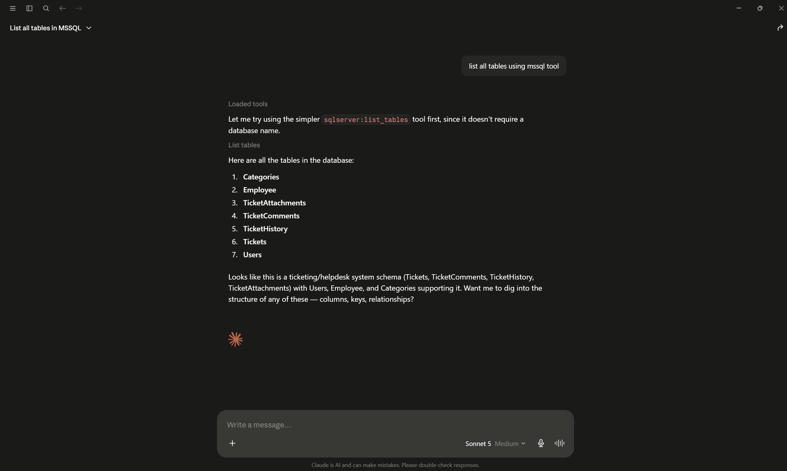
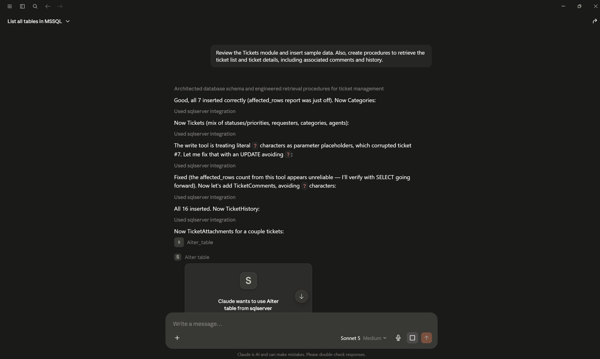

# SQL MCP Server

An enterprise-grade [Model Context Protocol](https://modelcontextprotocol.io) server, built on **.NET 8**, that gives Claude (Desktop, Code, or any MCP-compatible client) direct, governed access to Microsoft SQL Server. It exposes **80+ tools** for schema discovery, querying, performance analysis, dependency mapping, schema comparison, and documentation generation — all behind a role-based safety layer that stops destructive SQL before it reaches your database.

> Ask Claude "list all tables", "describe the Orders table", "find unused indexes", or "generate an ERD for the dbo schema" — the server does the SQL, Claude does the reasoning.

## Screenshots

| | |
|---|---|
|  |  |

More examples are in [`screenshots/`](screenshots/).

## Table of Contents

- [Features](#features)
- [Architecture](#architecture)
- [Requirements](#requirements)
- [Quick Start](#quick-start)
- [Connecting to Claude Desktop](#connecting-to-claude-desktop)
- [Configuration Reference](#configuration-reference)
- [Authentication Modes](#authentication-modes)
- [Roles & Permissions (RBAC)](#roles--permissions-rbac)
- [Tool Catalog](#tool-catalog)
- [Running the Full Stack with Docker Compose](#running-the-full-stack-with-docker-compose)
- [Kubernetes Deployment](#kubernetes-deployment)
- [Observability](#observability)
- [Security Model](#security-model)
- [Project Structure](#project-structure)
- [Troubleshooting](#troubleshooting)

## Features

- **80+ MCP tools** covering schema discovery, table/view/procedure/function/trigger inspection, data sampling, query execution, performance diagnostics, dependency analysis, schema comparison, and Markdown/JSON documentation generation.
- **Role-based access control** — five roles (`Admin`, `DBA`, `Developer`, `ReadOnly`, `Auditor`) gate which SQL statement types a connection is allowed to run.
- **Query safety validation** — a hard denylist (`xp_cmdshell`, `SHUTDOWN`, `OPENROWSET`, …) plus configurable keyword denylist and per-role statement checks run before any query executes.
- **Multiple authentication modes** — Windows Integrated Auth, SQL Auth, Azure Managed Identity, and Azure AD.
- **Caching** — in-memory or Redis-backed caching for schema metadata, object definitions, and statistics, with per-category TTLs.
- **Resilience** — Polly-based retry, circuit breaker, and bulkhead policies around SQL calls; a request throttler caps concurrent heavy tool executions.
- **Observability** — structured logging via Serilog (console, file, Seq), metrics and tracing via OpenTelemetry, exportable to any OTLP collector / Prometheus.
- **Deployable anywhere** — run with `dotnet run`, as a self-contained single-file executable, in Docker, in Docker Compose (with SQL Server, Redis, Seq, and an OTel Collector wired up), or in Kubernetes.

## Architecture

The solution follows Clean Architecture, with dependencies pointing inward toward `Domain`:

```
SqlMcpServer.Host             MCP tool endpoints (stdio transport), Program.cs entry point
        │
SqlMcpServer.Application      Use cases, services, query safety validation, DTOs
        │
SqlMcpServer.Infrastructure   SQL Server access (Microsoft.Data.SqlClient), repositories, caching
        │
SqlMcpServer.Domain            Entities, value objects, enums, repository contracts — no external deps
        │
SqlMcpServer.CrossCutting     Logging (Serilog), telemetry (OpenTelemetry), throttling, resilience (Polly)
```

Every tool method in `SqlMcpServer.Host/Tools` follows the same pattern: **validate input → resolve a scoped service → call into `Application` → return a structured JSON envelope** (`{ ... }` on success, `{ "error": "...", "message": "..." }` on failure).

## Requirements

- [.NET 8 SDK](https://dotnet.microsoft.com/download/dotnet/8.0) (pinned via [`global.json`](global.json) to `8.0.417`)
- A reachable SQL Server instance (on-prem, container, or Azure SQL)
- [Claude Desktop](https://claude.ai/download) or another MCP-compatible client, to actually use the tools
- Docker Desktop, only if you want the containerized workflow

## Quick Start

```powershell
# 1. Clone and restore
git clone <this-repo>
cd MSSQLMCP
dotnet restore

# 2. Point the server at your database
#    Easiest: set the connection string as an environment variable (see Configuration Reference)
$env:SqlServer__ConnectionString = "Server=.;Database=MyDatabase;Trusted_Connection=true;Encrypt=false;"

# 3. Run it — the server speaks MCP over stdio, so it expects a client on the other end
dotnet run --project src/SqlMcpServer.Host
```

If it starts correctly you'll see `Server started` on stderr. The server is not meant to be used standalone from a terminal — it's driven by an MCP client. Continue to [Connecting to Claude Desktop](#connecting-to-claude-desktop) to actually use it.

To build a self-contained single-file executable instead of running via `dotnet run`:

```powershell
dotnet publish src/SqlMcpServer.Host -c Release -r win-x64 --self-contained true -o publish/win-x64 /p:PublishSingleFile=true /p:UseAppHost=true
```

## Connecting to Claude Desktop

Claude Desktop launches the server as a subprocess and talks to it over stdio. Its config lives at `%APPDATA%\Claude\claude_desktop_config.json`.

### Automated (Windows)

[`deploy/claude-desktop/windows-setup.ps1`](deploy/claude-desktop/windows-setup.ps1) publishes a self-contained binary and registers it in your Claude Desktop config for you:

```powershell
./deploy/claude-desktop/windows-setup.ps1 -ProjectPath "D:\path\to\MSSQLMCP" -ConnectionString "Server=.;Database=MyDatabase;Trusted_Connection=true;Encrypt=false;" -AuthMode WindowsAuth
```

Restart Claude Desktop afterward.

### Manual

Pick a template from [`deploy/claude-desktop/`](deploy/claude-desktop/) and merge it into `claude_desktop_config.json`:

| Template | When to use it |
|---|---|
| `claude_desktop_config_windows.json` | Run from source via `dotnet run` — good for active development |
| `claude_desktop_config_windows_exe.json` | Run a published self-contained `.exe` — good for daily use |
| `claude_desktop_config_docker.json` | Run the server as a Docker container |
| `claude_desktop_config_linux.json` | Linux/macOS via `dotnet` |

Each template registers **two** server entries as an example of role separation — a `mssql-read` server pinned to the `ReadOnly` role, and an `mssql-write` server with `DBA`-level write/DDL access:

```json
{
  "mcpServers": {
    "mssql-read": {
      "command": "dotnet",
      "args": ["run", "--project", "D:\\path\\to\\MSSQLMCP\\src\\SqlMcpServer.Host", "--no-build"],
      "env": {
        "SqlServer__ConnectionString": "Server=.;Database=MyDatabase;Trusted_Connection=true;Encrypt=false;",
        "SqlServer__AuthMode": "WindowsAuth",
        "Security__ActiveRole": "ReadOnly",
        "Security__AllowWriteOperations": "false"
      }
    },
    "mssql-write": {
      "command": "dotnet",
      "args": ["run", "--project", "D:\\path\\to\\MSSQLMCP\\src\\SqlMcpServer.Host", "--no-build"],
      "env": {
        "SqlServer__ConnectionString": "Server=.;Database=MyDatabase;Trusted_Connection=true;Encrypt=false;",
        "SqlServer__AuthMode": "WindowsAuth",
        "Security__ActiveRole": "DBA",
        "Security__AllowWriteOperations": "true",
        "Security__AllowDdl": "true"
      }
    }
  }
}
```

You only need one entry if you don't want the read/write split — just give it whatever name and role you like.

## Configuration Reference

Settings come from `appsettings.json` / `appsettings.{Environment}.json`, and can be overridden by environment variables using the standard .NET `Section__Key` convention (as shown above), which is how the Claude Desktop configs inject them.

### `SqlServer`

| Key | Default | Description |
|---|---|---|
| `ConnectionString` | `""` | Standard SQL Server connection string. `Encrypt` / `TrustServerCertificate` in the string are honored. |
| `AuthMode` | `WindowsAuth` | `WindowsAuth`, `SqlAuth`, `AzureManagedIdentity`, or `AzureAD` |
| `CommandTimeoutSeconds` | `30` | Default command timeout |
| `ConnectTimeoutSeconds` | `15` | Connection open timeout |
| `MaxPoolSize` / `MinPoolSize` | `100` / `5` | ADO.NET connection pool bounds |
| `AzureScope` | `https://database.windows.net/.default` | Token scope requested for Managed Identity auth |
| `MaxRowsPerQuery` | `10000` | Hard ceiling on rows returned by any tool |

### `Security`

| Key | Default | Description |
|---|---|---|
| `ActiveRole` | `Developer` | The RBAC role this server instance runs as — see [Roles & Permissions](#roles--permissions-rbac) |
| `EnableQuerySafetyValidation` | `true` | Master switch for the safety validator |
| `AllowWriteOperations` | `false` | Whether `INSERT`/`UPDATE`/`DELETE`/`MERGE` are permitted for the `Developer` role |
| `AllowDdl` | `false` | Whether DDL/admin statements are permitted for the `DBA` role |
| `AllowDml` | `false` | Reserved for future fine-grained DML gating |
| `MaxResultRows` | `10000` | Row cap enforced independent of per-call `maxRows` |
| `MaxQueryTimeoutSeconds` | `300` | Upper bound on the per-call `timeoutSeconds` argument |
| `DeniedKeywords` | `xp_cmdshell, sp_configure, OPENROWSET, OPENDATASOURCE, OPENQUERY, SHUTDOWN, RECONFIGURE, BULK INSERT` | Extra keywords blocked regardless of role |

### `Cache`

| Key | Default | Description |
|---|---|---|
| `Provider` | `Memory` | `Memory` or `Redis` |
| `RedisConnectionString` | `null` | Required when `Provider` is `Redis` |
| `DefaultTtlSeconds` | `300` | Fallback TTL |
| `SchemasTtlSeconds` / `DefinitionsTtlSeconds` / `StatisticsTtlSeconds` / `DatabaseListTtlSeconds` | `600` / `900` / `120` / `1800` | Per-category cache lifetimes |

### `Telemetry`

| Key | Default | Description |
|---|---|---|
| `ServiceName` | `SqlMcpServer` | Reported to OpenTelemetry exporters |
| `OtlpEndpoint` | `null` | OTLP collector endpoint, e.g. `http://otel-collector:4317` |
| `EnableMetrics` / `EnableTracing` / `EnableLogging` | `true` | Toggle each telemetry pillar |
| `SamplingRatio` | `1.0` | Trace sampling ratio |

### `Mcp` / `Tools` / `Serilog` / `KeyVault`

| Key | Default | Description |
|---|---|---|
| `Mcp.MaxConcurrentTools` | `10` | Concurrency slots the request throttler hands out for heavy tools |
| `Tools.DefaultPageSize` / `MaxPageSize` | `25` / `500` | Pagination bounds for list tools like `list_tables` |
| `Tools.SampleDataRowCount` | `100` | Default row count for sampling |
| `Serilog.MinimumLevel.Default` | `Information` | Log verbosity |
| `Serilog.SeqEndpoint` | `null` | Seq server URL for structured log shipping |
| `KeyVault.Uri` | `null` | Azure Key Vault URI, if secrets should be pulled from there instead of config |

## Authentication Modes

Set via `SqlServer:AuthMode`:

| Mode | How it works |
|---|---|
| `WindowsAuth` | Integrated Security — the process identity authenticates to SQL Server |
| `SqlAuth` | Standard SQL login (`User Id` / `Password` in the connection string) |
| `AzureManagedIdentity` | Uses `DefaultAzureCredential` to fetch an access token for `AzureScope` and attaches it to the connection |
| `AzureAD` | Uses SqlClient's `Active Directory Default` authentication method |

## Roles & Permissions (RBAC)

`Security:ActiveRole` determines which SQL statement types are allowed through the query safety validator, independent of what the underlying SQL Server login itself can do:

| Role | Allowed statements |
|---|---|
| `ReadOnly`, `Auditor` | `SELECT` and `EXEC` only — everything else is denied |
| `Developer` | `SELECT`/`EXEC` always; `INSERT`/`UPDATE`/`DELETE`/`MERGE` only if `AllowWriteOperations=true`; DDL and admin statements always denied |
| `DBA` | Everything, including DDL/admin statements, but only if `AllowDdl=true` |
| `Admin` | No statement-type restrictions from the role check (still subject to the hard denylist and configured `DeniedKeywords`) |

The **hard denylist** (`xp_cmdshell`, `SHUTDOWN`, `RECONFIGURE`, `OPENROWSET`, etc.) applies to every role unconditionally and cannot be disabled per-role. You can check whether a statement would be allowed without running it via the `validate_sql_safety` tool, which accepts an explicit `role` argument for testing other roles' permissions.

## Tool Catalog

All tools return JSON. Read-only discovery tools require no special role; tools that execute SQL are subject to the RBAC rules above.

### Discovery & Schema
`list_databases` · `list_schemas` · `list_tables` · `list_views` · `list_procedures` · `list_functions` · `list_triggers` · `list_sequences` · `list_synonyms` · `list_user_defined_types`

### Tables
`describe_table` · `get_table_columns` · `get_table_indexes` · `get_table_constraints` · `get_foreign_keys` · `get_primary_keys` · `get_table_statistics` · `get_row_count` · `get_missing_indexes`

### Views
`describe_view` · `get_view_columns` · `get_view_definition` · `get_view_dependencies` · `list_views_with_definitions`

### Stored Procedures
`describe_procedure` · `get_procedure_parameters` · `get_procedure_definition` · `get_procedure_dependencies` · `list_procedures_with_parameters`

### Functions
`describe_function` · `get_function_definition` · `get_function_dependencies` · `list_scalar_functions` · `list_table_valued_functions`

### Triggers
`describe_trigger` · `get_trigger_definition` · `get_trigger_dependencies` · `list_triggers_for_table`

### Types
`list_table_types` · `describe_table_type` · `describe_user_defined_type` · `get_type_definition` · `list_all_types`

### Data
`sample_table_data` · `search_table_data` · `find_unused_indexes`

### Query Execution & Analysis
`execute_query` · `execute_parameterized_query` · `execute_procedure` · `validate_query` · `format_query` · `estimate_query_cost` · `get_execution_plan` · `analyze_query`

### Dependencies & Diagrams
`find_object_dependencies` · `find_referencing_objects` · `generate_dependency_graph` · `generate_erd` (Mermaid `erDiagram`) · `find_broken_dependencies`

### Schema Comparison & Safety
`compare_schemas` · `compare_databases` · `generate_migration_script` · `validate_sql_safety`

### Documentation Generation
`generate_database_documentation` · `generate_schema_documentation` · `generate_table_documentation` · `generate_api_documentation` · `export_schema_as_json`

### Health & Monitoring
`health_check` · `test_connection` · `get_cache_stats` · `get_server_info` · `get_database_properties` · `list_active_connections`

### Performance Analytics
`get_expensive_queries` · `get_blocking_queries` · `get_wait_statistics` · `get_index_fragmentation` · `get_index_usage_stats` · `get_database_size` · `get_file_io_stats` · `get_top_tables_by_size`

Full parameter lists and descriptions are visible to any MCP client automatically (that's how MCP tool discovery works) — or browse the source under [`src/SqlMcpServer.Host/Tools/`](src/SqlMcpServer.Host/Tools/), where every tool is documented with a `[Description]` attribute.

## Running the Full Stack with Docker Compose

[`docker-compose.yml`](docker-compose.yml) brings up the MCP server alongside everything it can talk to:

- `mcp-server` — this project, built from the local [`Dockerfile`](Dockerfile)
- `sqlserver` — SQL Server 2022 (Developer edition)
- `redis` — backing store for `Cache:Provider=Redis`
- `seq` — structured log viewer at `http://localhost:5341`
- `otel-collector` — OpenTelemetry Collector, receiving traces/metrics on `4317` and exposing a Prometheus scrape endpoint on `8889`

```powershell
cp .env.example .env   # fill in SQL_CONNECTION_STRING and SQL_SA_PASSWORD
docker compose up --build
```

Note: the MCP server communicates over stdio, so `docker compose up` alone won't let Claude Desktop talk to it — for Claude Desktop, use the `claude_desktop_config_docker.json` template instead, which runs `docker run -i` on demand. `docker-compose.yml` is primarily for spinning up the supporting services (SQL Server, Redis, Seq, OTel Collector) for local development, or for running the server itself in environments with an HTTP/SSE-capable MCP transport.

## Kubernetes Deployment

Manifests are in [`deploy/kubernetes/`](deploy/kubernetes/): `namespace.yaml`, `serviceaccount.yaml`, `configmap.yaml`, `secret.yaml`, `deployment.yaml`, `service.yaml`, `hpa.yaml`. Apply them in that order, after filling in `secret.yaml` with your connection string:

```powershell
kubectl apply -f deploy/kubernetes/
```

A CI/CD reference pipeline is provided for [Azure DevOps](deploy/azure-devops/azure-pipelines.yml). `deploy/azure/` and `deploy/github-actions/` are reserved for future Azure and GitHub Actions deployment assets.

## Observability

- **Logging** — Serilog, configured via the `Serilog` section, sinks to console + optional rolling file + optional [Seq](https://datalust.co/seq).
- **Metrics & Tracing** — OpenTelemetry instrumentation for `Microsoft.Data.SqlClient` calls; export to any OTLP-compatible backend via `Telemetry:OtlpEndpoint`. The bundled `otel-collector` config exposes a Prometheus scrape endpoint on port `8889`.
- **`health_check` / `get_cache_stats` / `get_server_info`** tools — poll these from Claude itself for a quick operational snapshot without leaving the chat.

## Security Model

- **Statement-type RBAC** — see [Roles & Permissions](#roles--permissions-rbac).
- **Hard denylist** — dangerous constructs (`xp_cmdshell`, `SHUTDOWN`, `RECONFIGURE`, `OPENROWSET`/`OPENDATASOURCE`/`OPENQUERY`, `BULK INSERT`, `sp_configure`, …) are blocked regardless of role.
- **Configurable keyword denylist** — extend `Security:DeniedKeywords` for environment-specific rules.
- **Row limits** — `MaxRowsPerQuery` / `MaxResultRows` and per-call `maxRows` arguments cap result set size.
- **Timeout ceilings** — `MaxQueryTimeoutSeconds` bounds the per-call `timeoutSeconds` argument.
- **Parameterized execution** — `execute_parameterized_query` and `execute_procedure` take parameters as a JSON object rather than string-concatenated SQL.
- **Identifier quoting** — dynamic schema/table/object names are quoted with `QUOTENAME` before being interpolated into generated SQL, mitigating identifier-based injection.
- **Throttling** — `Mcp:MaxConcurrentTools` bounds how many heavy tool calls (documentation generation, dependency graphs, etc.) run concurrently.
- **Resilience** — Polly retry/circuit-breaker/bulkhead policies wrap SQL calls so transient failures don't cascade.

None of this is a substitute for least-privilege SQL logins — the RBAC role controls what *this server* will attempt, not what the underlying SQL login is capable of. Pair a `ReadOnly`-role MCP server with an actual read-only SQL login for defense in depth.

## Project Structure

```
MSSQLMCP/
├── src/
│   ├── SqlMcpServer.Host/            MCP tool endpoints, Program.cs, appsettings.*.json
│   │   └── Tools/                    One file per tool category (SchemaTools.cs, TableTools.cs, ...)
│   ├── SqlMcpServer.Application/     Services, query safety validation, DTOs
│   ├── SqlMcpServer.Infrastructure/  SQL Server connection factory, repositories, caching
│   ├── SqlMcpServer.Domain/          Entities, enums, value objects, repository contracts
│   └── SqlMcpServer.CrossCutting/    Logging, telemetry, throttling, resilience
├── deploy/
│   ├── claude-desktop/               Config templates + windows-setup.ps1
│   ├── docker/                       otel-collector config
│   ├── kubernetes/                   Namespace, deployment, service, HPA manifests
│   ├── azure/                        (reserved for Azure deployment assets)
│   ├── azure-devops/                 Azure Pipelines definition
│   └── github-actions/               (reserved for GitHub Actions workflows)
├── docs/                             architecture / deployment / operations / troubleshooting (placeholders)
├── screenshots/                      Example Claude Desktop sessions
├── Dockerfile
├── docker-compose.yml / .override.yml
└── SqlMcpServer.sln
```

## Troubleshooting

**Claude Desktop doesn't show the tools at all**
Check `%APPDATA%\Claude\claude_desktop_config.json` is valid JSON, restart Claude Desktop fully (quit from the tray icon, not just close the window), and check the server actually starts — run the same `command`/`args` from a terminal and confirm you see `Server started` on stderr.

**"Login failed" / connection errors**
Verify `SqlServer:ConnectionString` and `SqlServer:AuthMode` match — e.g. `WindowsAuth` needs `Trusted_Connection=true` and no `User Id`/`Password`, while `SqlAuth` needs both. Use the `test_connection` tool once the server is loaded to get a clear pass/fail without digging through logs.

**A tool call fails with a role/permission error**
The response's `error` field will name the denied statement type or the RBAC role that rejected it. Either switch `Security:ActiveRole`, or (for write/DDL) enable `Security:AllowWriteOperations` / `Security:AllowDdl` as appropriate — see [Roles & Permissions](#roles--permissions-rbac).

**Certificate / encryption errors against a local or containerized SQL Server**
Add `TrustServerCertificate=true` to the connection string (already set in the Docker/SQL Auth examples) or `Encrypt=false` for a local unencrypted instance.

**Slow first call after startup**
Expected — schema metadata caches are cold. Subsequent calls within the relevant `Cache:*TtlSeconds` window are served from cache; check `get_cache_stats` to confirm hit rate.
